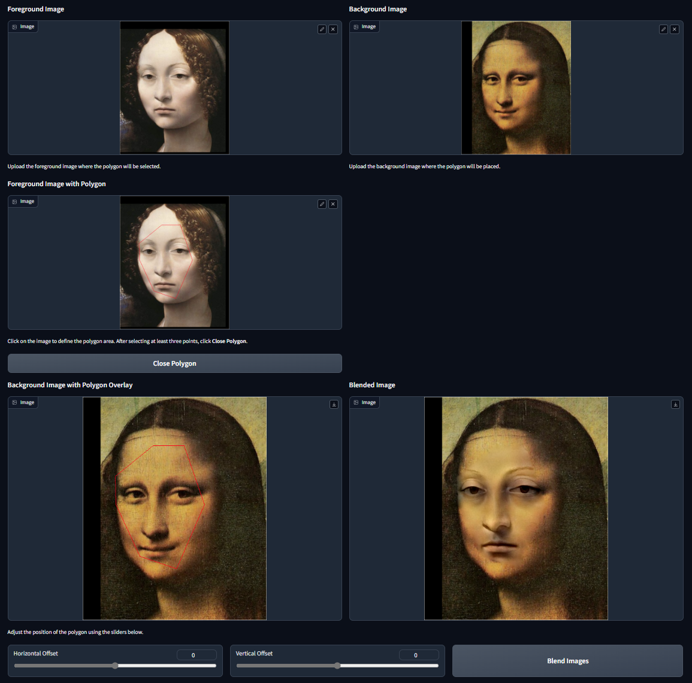
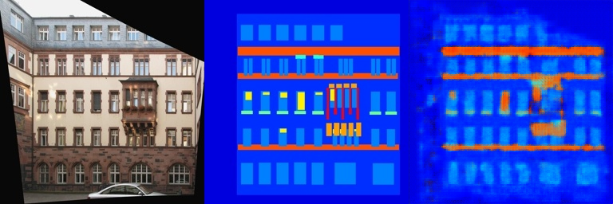
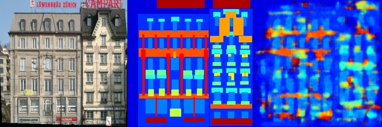
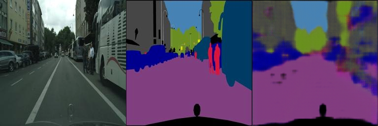

# Assignment 2 - DIP with PyTorch

## 1. Implement Poisson Image Editing with PyTorch.
### 实验结果

## 2. Pix2Pix implementation.
### 实验结果
#### facades数据集实验结果
##### 训练集
###### epoch25
！[epoch25](Pix2Pix/train_results/facades/epoch_25/result_1.png "epoch25_result1")

###### epoch250

###### epoch795

##### 预测集(epoch25,250,795)
###### result1

###### result2

###### result3

###### result4

###### result5

#### cityscapes数据集实验结果
##### 训练集
###### epoch25

###### epoch250

###### epoch795

##### 预测集(epoch25,250,795)
###### result1

###### result2

###### result3

###### result4

###### result5

### 实验结果分析
两个数据集的训练集效果都不错，预测集效果不行。但是由于cityscapes数据集更大，cityscapes的训练效果更佳，cityscapes的预测集预测效果比facades的要好。
---