# Assignment 4 - Implement Simplified 3D Gaussian Splatting

This repository is the official implementation of [Assignment 4 - Implement Simplified 3D Gaussian Splatting](https://github.com/YudongGuo/DIP-Teaching/tree/main/Assignments/04_3DGS).  


## Training

To train the model, run this command:
First, we use Colmap to recover camera poses and a set of 3D points.
```python
python mvs_with_colmap.py --data_dir data/chair
```

Debug the reconstruction by running:
```
python debug_mvs_by_projecting_pts.py --data_dir data/chair
```

build your 3DGS model:
```
python train.py --colmap_dir data/chair --checkpoint_dir data/chair/checkpoints
```

The above chair can be replaced with the lego dataset
## Results
Both datasets converge after 150 epochs, and the results of the 0th, 50th, 100th, and 150th epochs are shown below.
### chair
#### ours
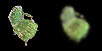

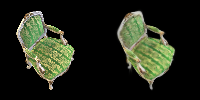


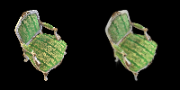

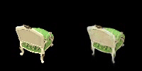

loss = 0.0254

#### Original Gauss
<table>
  <tr>
    <td>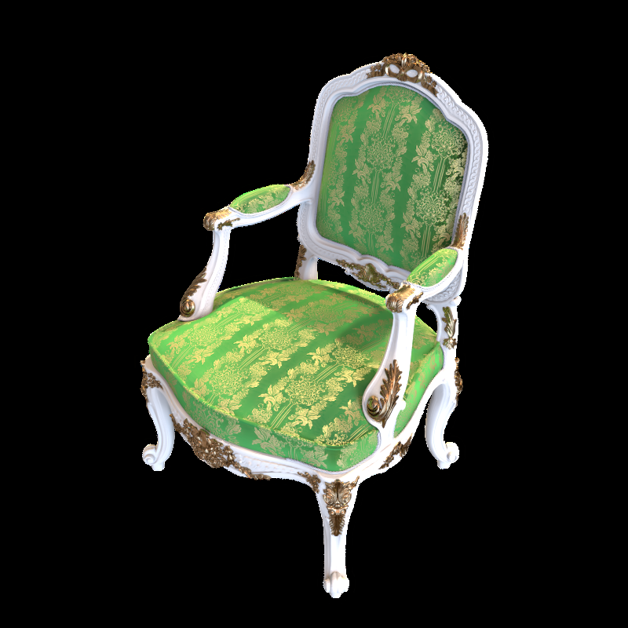</td>
    <td>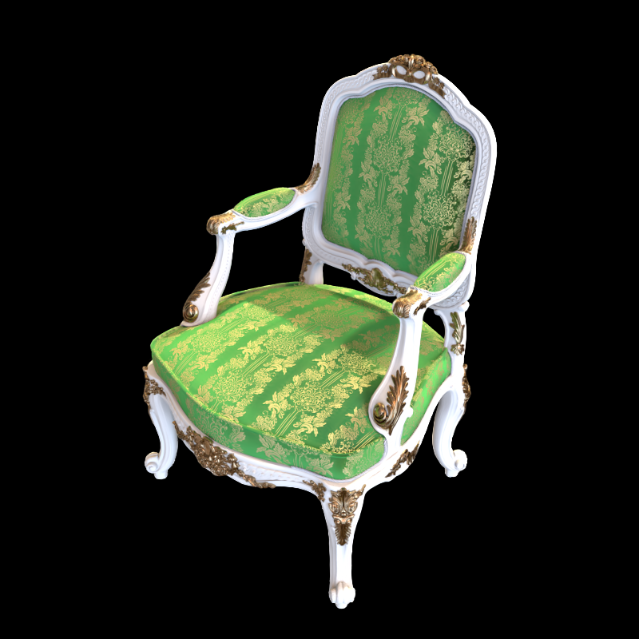</td>
  </tr>
</table>
loss = 0.0054

### lego
#### ours
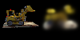

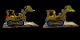

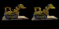

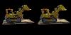

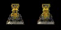
loss = 0.0335

#### Original Gauss
<table>
  <tr>
    <td>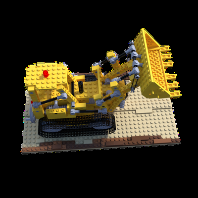</td>
    <td>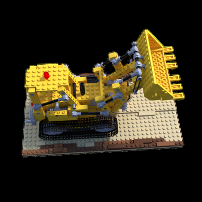</td>
  </tr>
</table>
loss = 0.0134